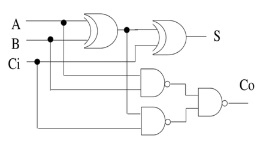

# VHDL

Rappresentazione dei circuiti portable, che unifica la sintesi di più tool grafici, standardizzando la sintassi in dei linguaggi. Quello che studiamo noi è il VHDL (Very High Speed Integrated Circuits Hardware Description Language).

### Precisazioni
Non è un linguaggio di programmazione, ma descrittivo, con corrispondenza a livello fisico delle componenti del circuito.

### Caratteristiche
- Case-insensitive
- Priorità standard degli operatori
- Concorrente, non sequenziale

### Elementi Strutturali - esempio di sintesi del circuito
- #### Entity (interfaccia): definizione di numoro e nomi di ingressi e uscite
L'entità FullAdder, con 3 ingressi (bit) e 2 uscite (bit):
``` vhdl
entity FullAdder is
    port(
        A, B, Cin : in  bit;
        Cout, S   : out bit;
    );
end FullAdder;
```

- #### Architecture: descrizione della funzione da svolgere


Si divide (con keyword `begin`) in due porzioni:
- dichiarativa: variabili, tipi, librerie
- descrittiva: funzioni 
``` vhdl
architecture Es1 of FullAdder is
-- parte dichiarativa può essere vuota
begin
    S    <= A xor B xor Cin;
    Cout <= (A nand B) nand (Cin nand (A xor B));
end Es1
```

- #### Signal:
Alternativamente, si può incapsulare l'espressione di `A xor B` come un `signal`:
``` vhdl
architecture Es1 of FullAdder is
    signal p: bit;
begin
    p    <= A xor B
    S    <= p xor Cin;
    Cout <= (A nand B) nand (Cin nand p);
end Es1
```
Essendo concorrenziale, l'ordine di queste operazioni è irrelevante.

