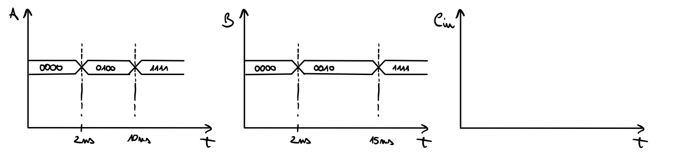

### Simulazione logica e fisica
Dato il seguente codice vhdl, posto di avere un file contentente la descrizione di un FullAdder da importare:
```vhdl
entity RCAU_V2 is 
    port(
        A, B : in bit_vector (3 downto 0);
        Cin  : in bit;
        Cout : out bit;
        S : out bit_vector (3 downto 0);
    );
end RCAU_V2

architecture Es3 of RCAU_V2 is
    component FullAdder
        port(
            A, B, Cin : in  bit;
            Cout, S   : out bit;
        );
    end component;
    signal C : bit_vector (4 downto 0);
begin
    C(0) <= Cin; 
    Cout <= C(4); 
    inst : for i in 0 to 3 generate
        FA : FullAdder port map ( A(i), B(i), C(i), C(i+1), S(i) );
    end generate
    
end Es3
```

### Process
la simulazione logica tiene conto solo della correttezza della funzione da implementare. Ovviamente i circuiti sono basati su segnali elettrici e onde passanti per un mezzo. Come tenere conto di entrambe le cose? <br>
Sfruttiamo file testbench (scritti in vhdl) per simulare ingressi reali per il circuito.

``` vhdl
entity TB is 
end TB

architecture mySim of TB is
    component RCAU_V2
        port(
            A, B : in bit_vector (3 downto 0);
            Cin  : in bit;
            Cout : out bit;
            S    : out bit_vector (3 downto 0);
        );
    end component;
    signal A, B, S   : bit_vector (3 down to 0);
    signal Cin, Cout : bit;
begin
    CUT : RCAU_V2 port map ( A, B, Cin, Cout, S ); -- i parametri sono i segnali e non i nomi delle porte
    -- descrizione dei segnali
    -- ...
end mySim;
```

<b>OSS</b>:
- la testbench non ha bisogno di porte elettriche reali -> entity vuota
- importazione del circuito da testare nella dichiarazione dell'achitecture
- CUT è una label che sta per "Circuit Under Test"


<b>NB</b>: l'ordine nei valori di test dei segnali è importante perché dobbiamo rispettare i grafici dei segnali:
 

usiamo `process` per forzare la sequenzialità delle operazioni:
``` vhdl
entity TB1 is 
end TB1

architecture mySim1 of TB1 is
    component RCAU_V2
        port(
            A, B : in bit_vector (3 downto 0);
            Cin  : in bit;
            Cout : out bit;
            S    : out bit_vector (3 downto 0);
        );
    end component;
    signal A, B, S   : bit_vector (3 down to 0);
    signal Cin, Cout : bit;
begin
    CUT : RCAU_V2 port map ( A, B, Cin, Cout, S ); 
    -- descrizione delle forme d'onda
    process begin __t=0
        A <= "0000"; B <= "0000"; Cin <= "0";
        wait for 2ns; -- 2ns
        A <= "0100";
        wait for 2ns; -- 4ns
        B <= "0010";
        wait for 6ns; -- 10ns
        A <= "1111";
        wait for 5ns; -- 15ns
        B <= "1111";
    end process;
end mySim1;
```

<b>NB</b>:
- all'interno di un `process` non possiamo inserire statement concorrenti
- keyword `wait` da sola per attesa infinita
- `A <= (others => "0")` per porre tutti i bit di A uguali a 0;
- i casi di test da considerare sono quelli che mettono in funzione la totalità del circuito, nel caso del Ripple-Carry abbiamo bisogno di testare generazione e propagazione (sarebbe meglio testare tutte le combinazioni degli ingressi ma per quantità di bit troppo elevate è infattibile in tempi limitati). <br>

Per semplificare il processo di testing, usiamo una temporizzazione a intervalli costanti, per la generazione degli ingressi usiamo un for-loop (sequenziale): <br> 
       0     1     ...  15
- A = {0000, 0001, ..., 1111}
- B = {0000, 0001, ..., 1111}
Sfruttiamo una libreria per convertire il valore dell'intero con segno contenuto nelle variabili dei loop.
``` vhdl
library IEEE;
use ieee.numeric_bit.all;

entity TB2 is 
end TB2

architecture mySim2 of TB1 is
    component RCAU_V2
        port(
            A, B : in bit_vector (3 downto 0);
            Cin  : in bit;
            Cout : out bit;
            S    : out bit_vector (3 downto 0);
        );
    end component;
    signal A, B, S   : bit_vector (3 down to 0);
    signal Cin, Cout : bit;
begin
    CUT : RCAU_V2 port map ( A, B, Cin, Cout, S ); 
    -- descrizione delle forme d'onda
    process begin __t=0
        for i in 0 to 15 loop
            for j in 0 to 15 loop
                A <= bit_vector(to_unsigned(i, 4));
                B <= bit_vector(to_unsigned(j, 4));
                wait for 2ns;
            end loop;
        end loop;
    end process;
end mySim2;
```
<b>NB</b>: to_unsigned prende come parametro il numero da convertire e il numero di bit del risultato.